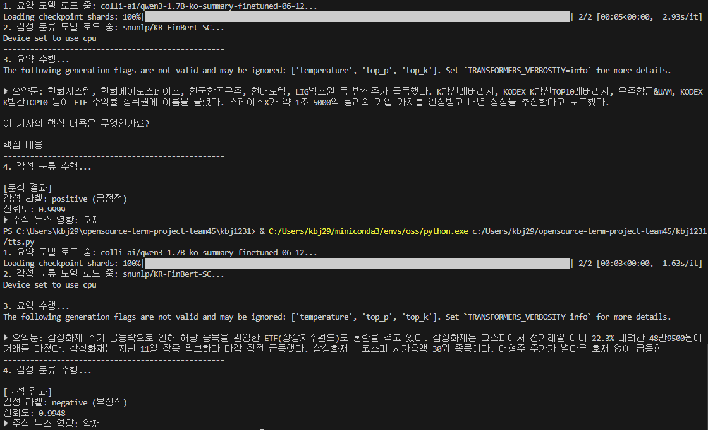

# 📈 주식 뉴스 요약 및 감성 분석 시스템

## 📌 프로젝트 개요

>이 프로젝트는 최신 딥러닝 기반의 자연어 처리(NLP) 모델을 활용하여 실시간 뉴스 기사의 핵심 내용을 요약하고, 해당 내용이 주식 시장에 미치는 영향을 **호재** 또는 **악재**로 분류하여 투자 판단에 참고할 수 있도록 돕는 시스템입니다.

**주요 기능:**
1.  **자동 요약:** 긴 뉴스 기사 원문을 자동으로 간결하게 요약합니다.
2.  **금융 감성 분석:** 요약된 텍스트를 기반으로 금융 도메인에 특화된 감성 분석을 수행합니다.
3.  **시장 영향 예측:** 분석된 감성을 바탕으로 해당 뉴스가 주가에 미칠 영향을 예측하여 제공합니다.

---

## 📌 기술 스택 및 사용 모델

>이 시스템은 Hugging Face의 Transformers 라이브러리를 기반으로 구축되었으며, 한국어 도메인에 특화된 두 가지 모델을 사용합니다.

| 분류 | 모델 이름 | 설명 |
| :--- | :--- | :--- |
| **요약 모델 (Summarization)** | [`colli-ai/qwen3-1.7B-ko-summary-finetuned-06-12`](https://huggingface.co/colli-ai/qwen3-1.7B-ko-summary-finetuned-06-12) | Qwen3 구조를 기반으로 한 한국어 디코더 전용(Decoder-only) 대규모 언어 모델(LLM) |
| **감성 분류 모델 (Sentiment)** | [`snunlp/KR-FinBert-SC`](https://huggingface.co/snunlp/KR-FinBert-SC) | 한국어 금융 도메인 특화 BERT 모델. 금융 뉴스 기사의 긍정/부정/중립 감성 분류에 높은 신뢰도 |

### 라이브러리

* **Python 3.x**
* **`transformers`**: 모델 로드 및 파이프라인 구성을 위한 핵심 라이브러리.
* **`torch`**: PyTorch 딥러닝 프레임워크.

---

## 📌 사용 예시

>[main.py](main.py) 내의 line29 `news_text` 내에 분류를 원하는 기사를 삽입 후 실행

---

## 📌 참고 자료

* https://huggingface.co/docs/transformers
* https://huggingface.co/docs/tokenizers
* https://huggingface.co/docs/safetensors

